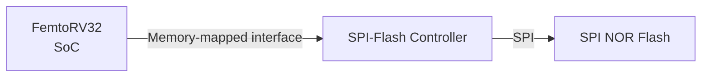
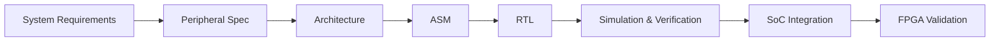
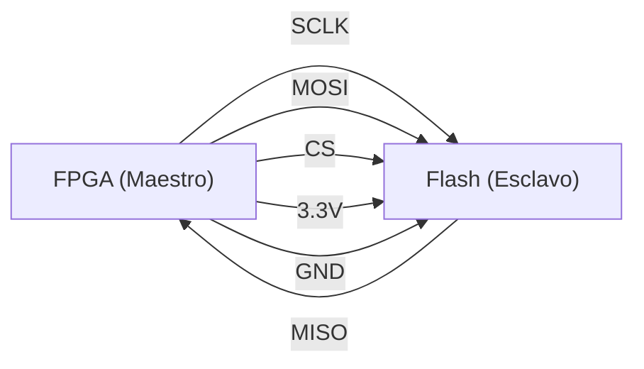
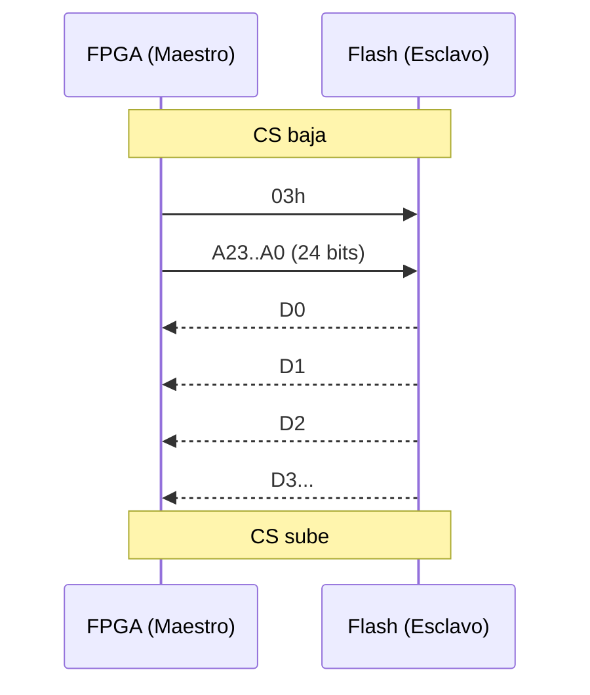
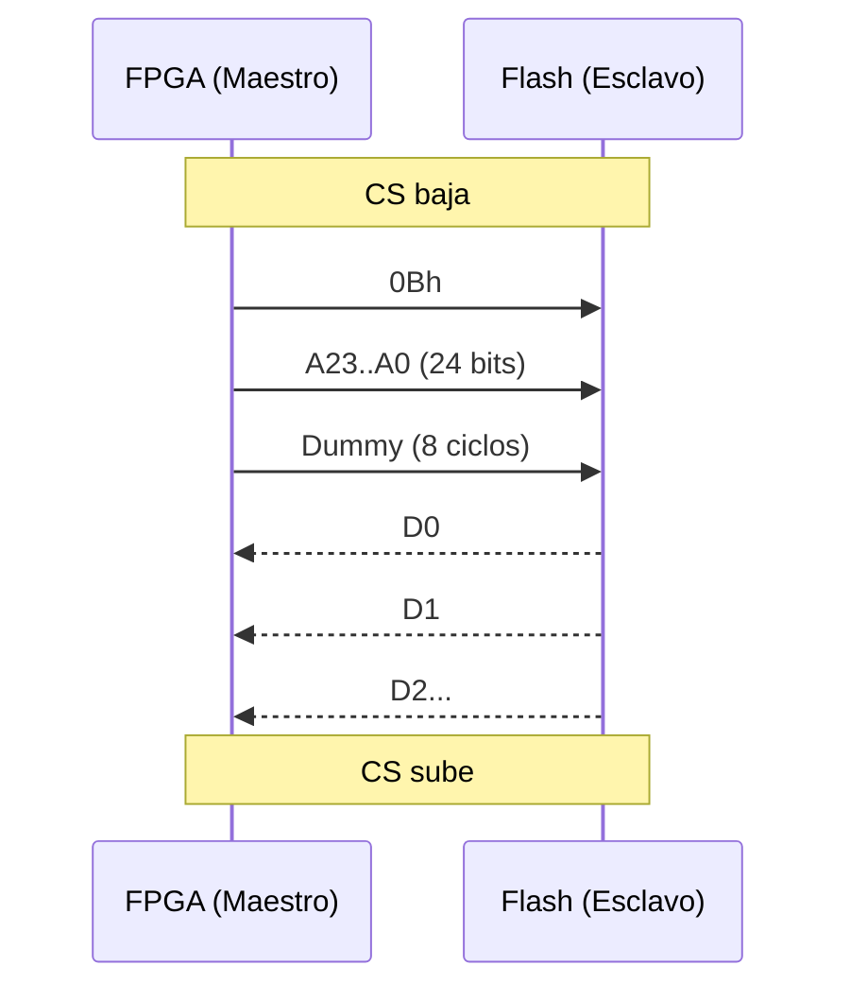

# SPI-Flash Controller Peripheral — FemtoRV32 SoC

**Project:** FPGA Retro Video Game Console (PBL Methodology)  
**Course:** Digital Design I — 2026-2  
**Institution:** Universidad Nacional de Colombia — Sede Bogotá  
**Faculty:** Ingeniería — Departamento de Ingeniería Eléctrica y Electrónica  
**Course Upstream Repository:** [digital_UN (Prof. Carlos Camargo)](https://github.com/cicamargoba/digital_UN)  

## Development Team:
* **Jhon Dairon Canizalez Arias** — [@jcanizalez16](https://github.com/jcanizalez16)
* **Edwin Franco Sánchez** - [@edfrancos](https://github.com/edfrancos)
* **Carlos Alfonso Mahecha Gonzalez** - [camahechag]

## 1. Project Overview

This repository contains the design, implementation, verification, and integration of the SPI-Flash Controller, a memory-mapped peripheral responsible for interfacing the FemtoRV32-based SoC with an external SPI NOR Flash memory.

The controller implements the communication required to access the Flash device through the Serial Peripheral Interface (SPI) protocol and exposes this functionality to the processor through a memory-mapped interface.

From the system perspective, the **SPI-Flash Controller** acts as an intermediate layer between two different interfaces. 



The project follows the course methodology:



Each stage establishes artifacts and design decisions that serve as inputs to the following stage. The repository therefore documents both the final implementation and the engineering process used to obtain and verify it.

## 2. Scope
The scope of this project is the complete implementation of the digital interface between the FemtoRV32-based SoC and the external SPI Flash memory assigned to the project.

The scope of the design includes:
* specification of the interface between the processor and the peripheral;
* specification of the SPI Flash communication protocol required by the project;
* definition of the controller architecture;
* design of the control unit and datapath;
* definition of the memory-mapped registers used by the processor;
* implementation of the controller in synthesizable RTL;
* development of a simulation environment for functional verification;
* development of the corresponding firmware interface;
* integration with the SoC;
* validation of the peripheral on the FPGA hardware.

The FemtoRV32 processor is treated as a black-box component. Its internal implementation is therefore outside the scope of this project; the controller is designed according to the interfaces and system-level requirements established by the course project.

The detailed requirements, architectural decisions, register definitions, SPI transactions, RTL implementation, and verification procedures are developed in the subsequent sections of this documentation.

## 3. Documentation
Each documentation stage establishes the artifacts and decisions required by the subsequent design stage. The initial stages establish what the peripheral must do; subsequent chapters describe how those requirements are transformed into an implementable architecture and verified through simulation and hardware:

| Stage | Purpose |
|---|---|
| [01 — Specification](docs/01_specification/) | Define what the peripheral must do |
| [02 — Architecture](docs/02_architecture/) | Define how the required functionality is decomposed |
| [03 — Design](docs/03_design/) | Transform the architecture into ASM, FSM, datapath and RTL |
| [04 — Verification](docs/04_verification/) | Define and demonstrate how the design is verified |
| [05 — Integration](docs/05_integration/) | Integrate the peripheral into the SoC and validate it on hardware |

Additional repository directories contain the implementation artifacts:

| Directory | Contents |
|---|---|
| `rtl/` | Synthesizable RTL and RTL testbenches |
| `firmware/` | C driver and firmware tests |
| `simulation/` | Simulation outputs and verification evidence |
| `diagrams/` | Source and exported engineering diagrams |
| `integration/` | SoC and FPGA integration artifacts |
| `planificacion/` | Project planning and task tracking |

## 4. Development Status

| Stage | Status |
|---|---|
| Requirements | In progress |
| SPI Flash specification | In progress |
| CSR specification | Pending |
| Architecture | Pending |
| ASM | Pending |
| RTL | Pending |
| Verification | Pending |
| Firmware | Pending |
| SoC integration | Pending |
| FPGA validation | Pending |

##############################################################################################################################

## 1. Introducción

Este documento describe el protocolo **SPI (Serial Peripheral Interface)** aplicado a **memorias Flash**, tal como se trabajó en clase. Incluye forma física, explicación del protocolo, comandos disponibles, uso práctico de `READ` y `FAST READ`, y las preguntas resueltas que quedaron pendientes.

> **Nota:** Los diagramas de trama y conexión física están en este mismo directorio. Ver la sección de enlaces al final.

---

## 2. ¿Qué es SPI?

SPI es un protocolo de comunicación **sincrónico, serie y full-duplex**. Un dispositivo **maestro** (en nuestro caso la FPGA) controla a uno o varios **esclavos** (aquí, la memoria Flash).

### 2.1 Señales del bus

| Señal | Nombre completo | Función |
|-------|-----------------|---------|
| `SCLK` | Serial Clock | Reloj generado **siempre** por el maestro |
| `MOSI` | Master Out Slave In | Datos del maestro hacia el esclavo |
| `MISO` | Master In Slave Out | Datos del esclavo hacia el maestro |
| `CS` / `SS` | Chip Select / Slave Select | Activo en bajo. Selecciona el esclavo |

### 2.2 Características clave

- Es **sincrónico**: los datos se leen en flancos del reloj.
- Es **full-duplex**: MOSI y MISO pueden trabajar al mismo tiempo.
- El **maestro genera el reloj**. El esclavo nunca lo genera.
- En SPI **la velocidad no es crítica** para la integridad del dato. A diferencia de I2S, se puede ir más rápido o más lento sin que el dato se corrompa, siempre que se respeten los tiempos mínimos del chip.

> Cita de clase: *"En un SPI, si es lento, obviamente… Puede que se demore más, pero puedo mandar los datos. Si eso cumple restricciones temporales, no importa."*

### 2.3 Modos SPI (CPOL / CPHA)

| Modo | CPOL | CPHA | Flanco de muestreo |
|------|------|------|---------------------|
| 0 | 0 | 0 | Subida |
| 1 | 0 | 1 | Bajada |
| 2 | 1 | 0 | Bajada |
| 3 | 1 | 1 | Subida |

En memorias Flash se usa normalmente **Modo 0** o **Modo 3**.

---

## 3. Forma física

### 3.1 Conexión FPGA ↔ Flash



### 3.2 Tabla de conexión

| FPGA (Maestro) | Dirección | Flash (Esclavo) | Pin Flash |
|----------------|-----------|-----------------|-----------|
| SCLK | → | CLK | 6 |
| MOSI | → | DI (IO0) | 5 |
| MISO | ← | DO (IO1) | 2 |
| CS | → | CS# | 1 |
| 3.3V | → | VCC | 8 |
| GND | → | GND | 4 |

### 3.3 Niveles de voltaje

- La FPGA típicamente maneja **3.3 V**.
- La Flash SPI también trabaja a **3.3 V**.
- **Importante:** si un chip trabaja a 5 V y otro a 3.3 V, hay que poner un adaptador de niveles. Esto se discutió en clase para las matrices LED, y aplica igual aquí.

### 3.4 Pines típicos de una Flash (ejemplo SOIC-8)

| Pin | Nombre | Función |
|-----|--------|---------|
| 1 | CS# | Chip Select (activo bajo) |
| 2 | DO (IO1) | Datos de salida / IO1 en Quad |
| 3 | WP# (IO2) | Write Protect / IO2 en Quad |
| 4 | GND | Tierra |
| 5 | DI (IO0) | Datos de entrada / IO0 en Quad |
| 6 | CLK | Reloj |
| 7 | HOLD# (IO3) | Hold / IO3 en Quad |
| 8 | VCC | Alimentación (3.3 V) |

---

## 4. Protocolo de comunicación

### 4.1 Estructura general de una transacción

Toda transacción con la Flash sigue este patrón:

```
CS baja  →  [Comando]  →  [Dirección]  →  [Dummy]  →  [Datos]  →  CS sube
```

- **Comando:** 1 byte que dice qué hacer.
- **Dirección:** 3 bytes (24 bits) que indican la posición de memoria.
- **Dummy:** 0 o más bytes de relleno (solo en algunos comandos).
- **Datos:** bytes de lectura o escritura.

### 4.2 Reloj y flancos

- **CS baja** al inicio de la transacción.
- El maestro genera el reloj.
- **El dato cambia en un flanco y se lee en el otro.**
- Regla de oro vista en clase:

> *"No puedo tener cambios de la señal de dato al mismo tiempo que el flanco de lectura. Siempre que el clock cambia, el dato tiene que estar estable."*

---

## 5. Comandos disponibles

### 5.1 Comandos de estado y control

| Código | Nombre | Función |
|--------|--------|---------|
| `06h` | Write Enable | Habilita escritura (obligatorio antes de escribir/borrar) |
| `04h` | Write Disable | Deshabilita escritura |
| `05h` | Read Status Register 1 | Revisa WIP (busy) y WEL |
| `35h` | Read Status Register 2 | Info adicional del chip |
| `C7h` / `60h` | Chip Erase | Borra toda la memoria |

### 5.2 Comandos de lectura

| Código | Nombre | Dummy | Velocidad típica |
|--------|--------|-------|-------------------|
| `03h` | READ | No | 50 MHz |
| `0Bh` | FAST READ | 1 byte | 104 MHz |
| `3Bh` | FAST READ DUAL OUTPUT | 1 byte | 104 MHz |
| `BBh` | FAST READ DUAL I/O | 1 byte (modo) | 104 MHz |
| `6Bh` | FAST READ QUAD OUTPUT | 1 byte | 104 MHz |
| `EBh` | FAST READ QUAD I/O | 1 byte (modo) | 104 MHz |

### 5.3 Comandos de escritura y borrado

| Código | Nombre | Función |
|--------|--------|---------|
| `02h` | Page Program | Escribe hasta 256 bytes en una página |
| `20h` | Sector Erase | Borra 4 KB |
| `52h` | Block Erase 32 KB | Borra 32 KB |
| `D8h` | Block Erase 64 KB | Borra 64 KB |
| `C7h` / `60h` | Chip Erase | Borra toda la memoria |

---

## 6. READ (03h) paso a paso

### 6.1 Secuencia

1. **CS baja.**
2. Enviar `03h` por MOSI.
3. Enviar **dirección de 24 bits** (3 bytes, MSB primero).
4. La Flash empieza a devolver datos por MISO.
5. **CS sube** al terminar.

### 6.2 Trama (diagrama Mermaid)



### 6.3 Tabla de la trama

| Fase | MOSI (FPGA → Flash) | MISO (Flash → FPGA) |
|------|---------------------|---------------------|
| Comando | `03h` | X (no importa) |
| Dirección | A23..A0 (24 bits) | X (no importa) |
| Datos | (no se usa) | D0, D1, D2, D3… |

### 6.4 ¿Cuánta información devuelve?

**Ilimitada.** Mientras CS esté bajo, la Flash sigue sacando bytes y la dirección interna avanza sola. Al llegar al final, vuelve al inicio (**wrap around**).

> Cita de clase: *"hay que tener cuidado porque ese se sobrecribe… termina a los 64 espacios y vuelve a escribir el primero."*

---

## 7. FAST READ (0Bh) paso a paso

### 7.1 Secuencia

1. **CS baja.**
2. Enviar `0Bh` por MOSI.
3. Enviar **dirección de 24 bits**.
4. Enviar **1 byte dummy** (8 ciclos de reloj, MISO ignorado).
5. La Flash devuelve datos por MISO.
6. **CS sube.**

### 7.2 Trama (diagrama Mermaid)



### 7.3 Tabla de la trama

| Fase | MOSI (FPGA → Flash) | MISO (Flash → FPGA) |
|------|---------------------|---------------------|
| Comando | `0Bh` | X (no importa) |
| Dirección | A23..A0 (24 bits) | X (no importa) |
| Dummy | (nada) | X (8 ciclos vacíos) |
| Datos | (no se usa) | D0, D1, D2, D3… |

---

## 8. Preguntas resueltas

### 8.1 ¿Por qué FAST READ es más rápido si **añade** un byte dummy?

Porque el byte dummy **no es trabajo extra**, es **tiempo de preparación** para la Flash. La memoria necesita:

- Decodificar la dirección.
- Acceder a la celda de memoria.
- Cargar el dato en el registro de salida.

Ese proceso toma tiempo fijo (nanosegundos). El dummy le da ese tiempo al chip.

**La ganancia real viene de la frecuencia de reloj.**

Cálculo para leer **N = 1000 bytes**:

READ normal a 50 MHz:

$$
T_{read} = \frac{8 + 24 + 8000}{50\times 10^6} = \frac{8032}{50\times 10^6} = 160.6\ \mu s
$$

FAST READ a 104 MHz:

$$
T_{fast} = \frac{8 + 24 + 8 + 8000}{104\times 10^6} = \frac{8040}{104\times 10^6} = 77.3\ \mu s
$$

**FAST READ es ~2 veces más rápido** aunque tenga 8 ciclos extra. El dummy cuesta muy poco y a cambio se duplica la frecuencia.

> **Regla mental:** el byte dummy es la **cuota de entrada** para poder correr el reloj al doble.

### 8.2 ¿Solo se pueden leer 8 bits por comando?

**No.** Cada byte son 8 bits, pero al mantener CS bajo la Flash sigue entregando bytes y **avanza sola la dirección** (modo burst / continuous read).

### 8.3 ¿Toca enviar la trama de nuevo para leer más bits?

**No.** Solo se manda **una vez** comando + dirección. Después se sigue dando reloj y los datos salen consecutivos.

Ejemplo: leer un `uint32_t` desde `0x000100`:

```
CS baja
→ 03h
→ 00h 01h 00h   (dirección)
→ recibes byte0, byte1, byte2, byte3
→ unes: dato = (byte0<<24)|(byte1<<16)|(byte2<<8)|byte3
CS sube
```

### 8.4 ¿Qué comandos van antes o después?

- **Para leer:** no se necesita comando previo.
- **Para escribir o borrar:** primero `06h` (Write Enable).
- **Después de escribir:** revisar con `05h` (Read Status Register) si el chip terminó.

### 8.5 ¿Qué diferencia hay con I2S?

En **I2S** la frecuencia de muestreo sí importa (44.2 kHz, 48 kHz). Si se manda el audio más rápido o más lento, se escucha mal. En **SPI** la velocidad no afecta el dato, solo el tiempo que tarda.

> Cita de clase: *"Es la gran diferencia de protocolos SPI frente a todos los demás: el tiempo acá sí importa [en I2S], en los demás no."*

---

## 9. Usos prácticos

### 9.1 Almacenar imágenes o audio del juego

La Flash guarda el fondo de pantalla, sprites o el archivo de audio. La FPGA lee por SPI y luego manda a la pantalla o al DAC.

### 9.2 Leer varios bytes rápido

Usar **FAST READ** en lugar de **READ** cuando se leen bloques grandes. Para leer una sola posición pequeña, la diferencia es mínima.

### 9.3 Escritura

Antes de escribir:

1. Enviar `06h` (Write Enable).
2. Enviar `02h` (Page Program) con dirección y hasta 256 bytes.
3. Esperar con `05h` hasta que WIP = 0.

### 9.4 Borrado

- `20h` → sector de 4 KB.
- `D8h` → bloque de 64 KB.
- `C7h` → toda la memoria.

**Cuidado:** en Flash solo se borra por sectores o bloques, no bit a bit.

### 9.5 Modo burst

Si vas a leer 512 bytes consecutivos, manda la dirección **una sola vez** y sigue dando reloj.

---

## 10. Diagramas incluidos en este directorio

| Archivo | Descripción |
|---------|-------------|
| `read_03h.png` | Trama del comando READ |
| `fast_read_0bh.png` | Trama del comando FAST READ |
| `conexion_fpga_flash.png` | Diagrama físico FPGA ↔ Flash |
| `comparacion_tiempos.png` | Gráfica READ vs FAST READ |
| `comandos_spi_flash.png` | Tabla resumen de comandos |

> Los diagramas se generan con [WaveDrom](https://wavedrom.com) siguiendo la recomendación del profesor de usar herramientas para hacer las formas de onda.

---

## 11. Dependencias y enlaces

- Issue [#1](https://github.com/noNintendo2026/spi_flash_ctrl/issues/1)
- Issue [#2](https://github.com/noNintendo2026/spi_flash_ctrl/issues/2)
- Issue [#3](https://github.com/noNintendo2026/spi_flash_ctrl/issues/3)
- Wiki del curso (actualizar aquí)
- Datasheet de la Flash usada (agregar número de parte específico)

---

## 12. Criterios de aceptación

- [ ] Revisión por @camahechag-bars.
- [ ] Revisión por @jcanizalez16.
- [ ] Revisión por @edfrancos.
- [ ] Toda la información de los issues #1, #2 y #3 está incluida.
- [ ] Diagramas PNG en este directorio.
- [ ] Enlaces a los archivos pertinentes funcionando.

---

## 13. Referencias

- Clase de SPI Flash (transcripción del curso, 2026-09-29).
- Datasheet típico de Flash SPI (ejemplo: W25Q128JV, Winbond).
- Documentación de WaveDrom.

---

**Última actualización:** 2026-10-06  
**Autores:** @camahechag-bars, @jcanizalez16, @edfrancos
