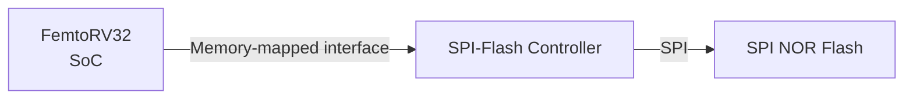
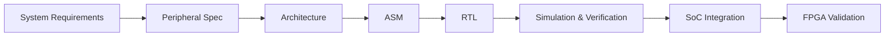

# SPI-Flash Controller Peripheral — FemtoRV32 SoC

**Project:** FPGA Retro Video Game Console (PBL Methodology)  
**Course:** Digital Design I — 2026-2  
**Institution:** Universidad Nacional de Colombia — Sede Bogotá  
**Faculty:** Ingeniería — Departamento de Ingeniería Eléctrica y Electrónica  
**Course Upstream Repository:** [digital_UN (Prof. Carlos Camargo)](https://github.com/cicamargoba/digital_UN)  

## Development Team:
* **Jhon Dairon Canizalez Arias** — [@jcanizalez16](https://github.com/jcanizalez16)
* **Edwin Franco Sánchez** - [@edfrancos](https://github.com/edfrancos)
* **Carlos Alfonso Mahecha Gonzalez** - [camahechag]

## 1. Project Overview

This repository contains the design, implementation, verification, and integration of the SPI-Flash Controller, a memory-mapped peripheral responsible for interfacing the FemtoRV32-based SoC with an external SPI NOR Flash memory.

The controller implements the communication required to access the Flash device through the Serial Peripheral Interface (SPI) protocol and exposes this functionality to the processor through a memory-mapped interface.

From the system perspective, the **SPI-Flash Controller** acts as an intermediate layer between two different interfaces. 

The project follows the course methodology:

Each stage establishes artifacts and design decisions that serve as inputs to the following stage. The repository therefore documents both the final implementation and the engineering process used to obtain and verify it.

## 2. Scope
The scope of this project is the complete implementation of the digital interface between the FemtoRV32-based SoC and the external SPI Flash memory assigned to the project.

The scope of the design includes:
* specification of the interface between the processor and the peripheral;
* specification of the SPI Flash communication protocol required by the project;
* definition of the controller architecture;
* design of the control unit and datapath;
* definition of the memory-mapped registers used by the processor;
* implementation of the controller in synthesizable RTL;
* development of a simulation environment for functional verification;
* development of the corresponding firmware interface;
* integration with the SoC;
* validation of the peripheral on the FPGA hardware.

The FemtoRV32 processor is treated as a black-box component. Its internal implementation is therefore outside the scope of this project; the controller is designed according to the interfaces and system-level requirements established by the course project.

The detailed requirements, architectural decisions, register definitions, SPI transactions, RTL implementation, and verification procedures are developed in the subsequent sections of this documentation.

## 3. Documentation
Each documentation stage establishes the artifacts and decisions required by the subsequent design stage. The initial stages establish what the peripheral must do; subsequent chapters describe how those requirements are transformed into an implementable architecture and verified through simulation and hardware:

| Stage | Purpose |
|---|---|
| [01 — Specification](docs/01_specification/) | Define what the peripheral must do |
| [02 — Architecture](docs/02_architecture/) | Define how the required functionality is decomposed |
| [03 — Design](docs/03_design/) | Transform the architecture into ASM, FSM, datapath and RTL |
| [04 — Verification](docs/04_verification/) | Define and demonstrate how the design is verified |
| [05 — Integration](docs/05_integration/) | Integrate the peripheral into the SoC and validate it on hardware |

Additional repository directories contain the implementation artifacts:

| Directory | Contents |
|---|---|
| `rtl/` | Synthesizable RTL and RTL testbenches |
| `firmware/` | C driver and firmware tests |
| `simulation/` | Simulation outputs and verification evidence |
| `diagrams/` | Source and exported engineering diagrams |
| `integration/` | SoC and FPGA integration artifacts |
| `planificacion/` | Project planning and task tracking |

## 4. Development Status

| Stage | Status |
|---|---|
| Requirements | In progress |
| SPI Flash specification | In progress |
| CSR specification | Pending |
| Architecture | Pending |
| ASM | Pending |
| RTL | Pending |
| Verification | Pending |
| Firmware | Pending |
| SoC integration | Pending |
| FPGA validation | Pending |