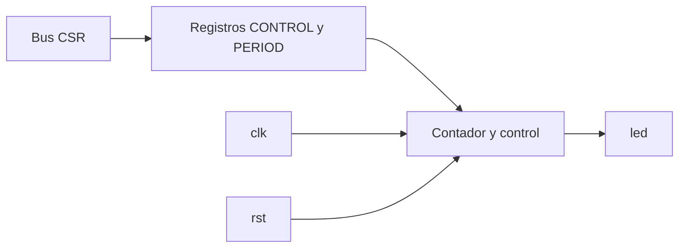
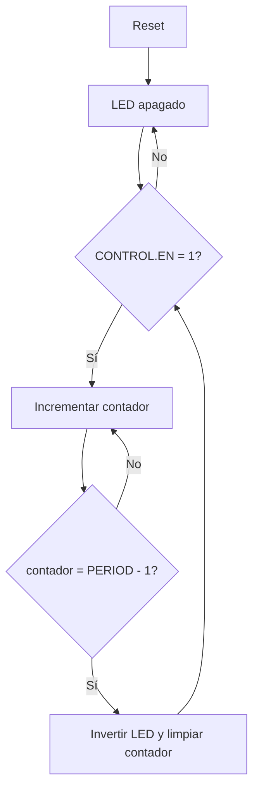

# Diagrama del periférico `blink`

```mermaid
flowchart LR
    BUS[Bus CSR] --> REGS[Registros CONTROL y PERIOD]
    REGS --> CTRL[Contador y control]
    CLK[clk] --> CTRL
    RST[rst] --> CTRL
    CTRL --> LED[led]
```

## Flujo de operación

```mermaid
flowchart TD
    A[Reset] --> B[LED apagado]
    B --> C{CONTROL.EN = 1?}
    C -- No --> B
    C -- Sí --> D[Incrementar contador]
    D --> E{contador = PERIOD - 1?}
    E -- No --> D
    E -- Sí --> F[Invertir LED y limpiar contador]
    F --> C
```
