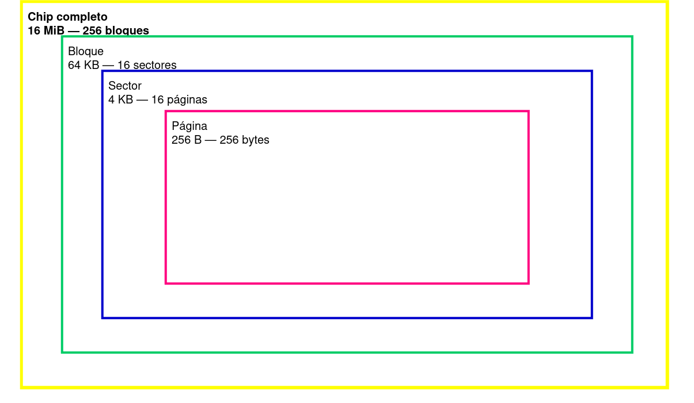
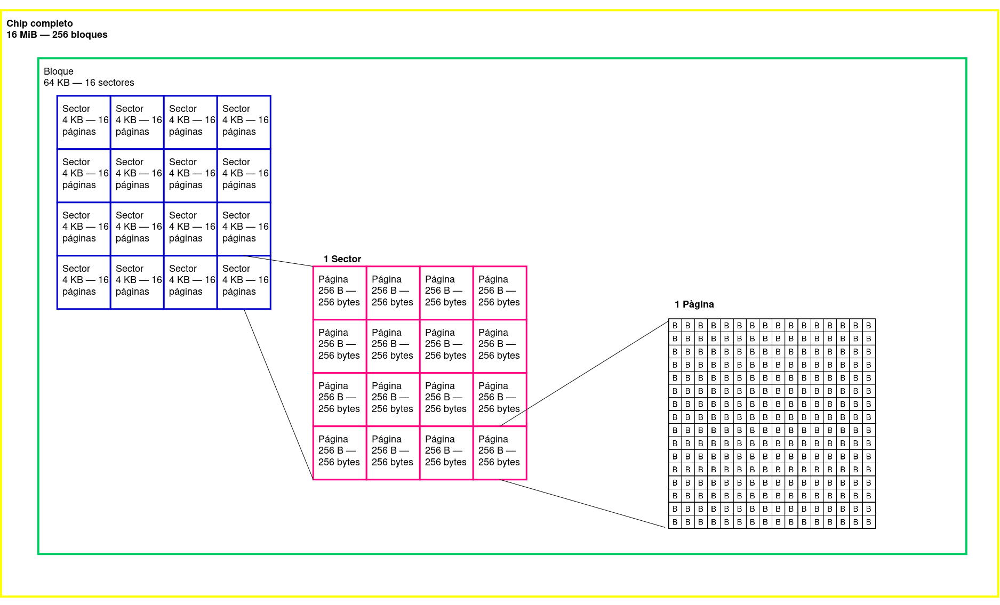
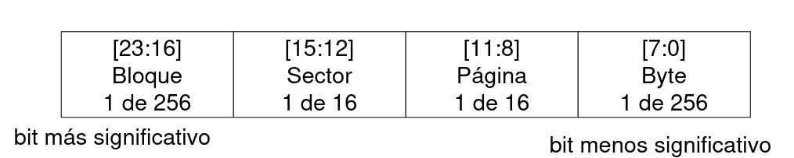
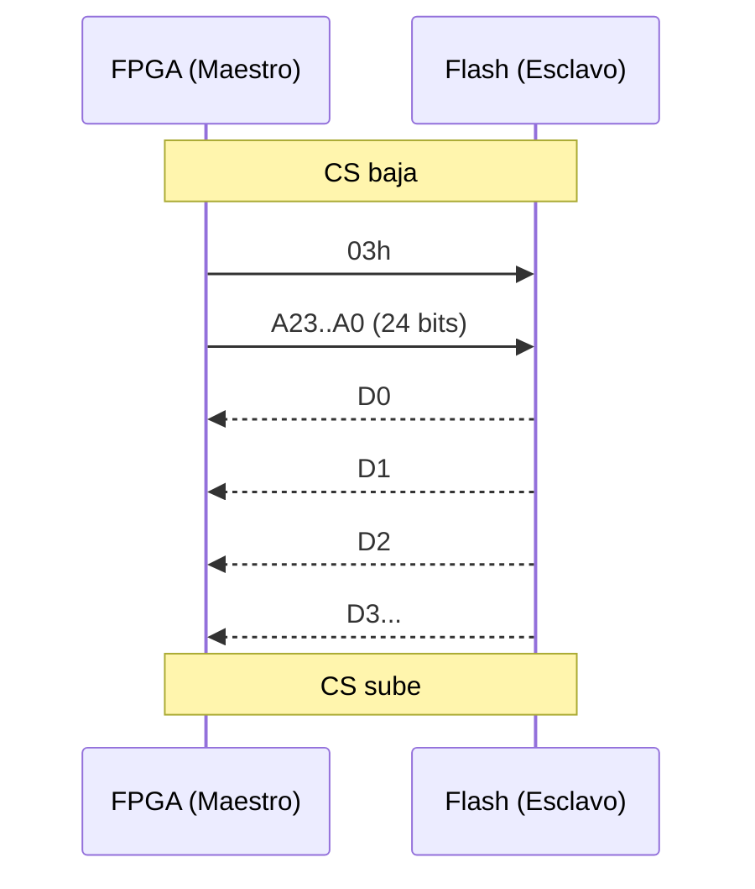
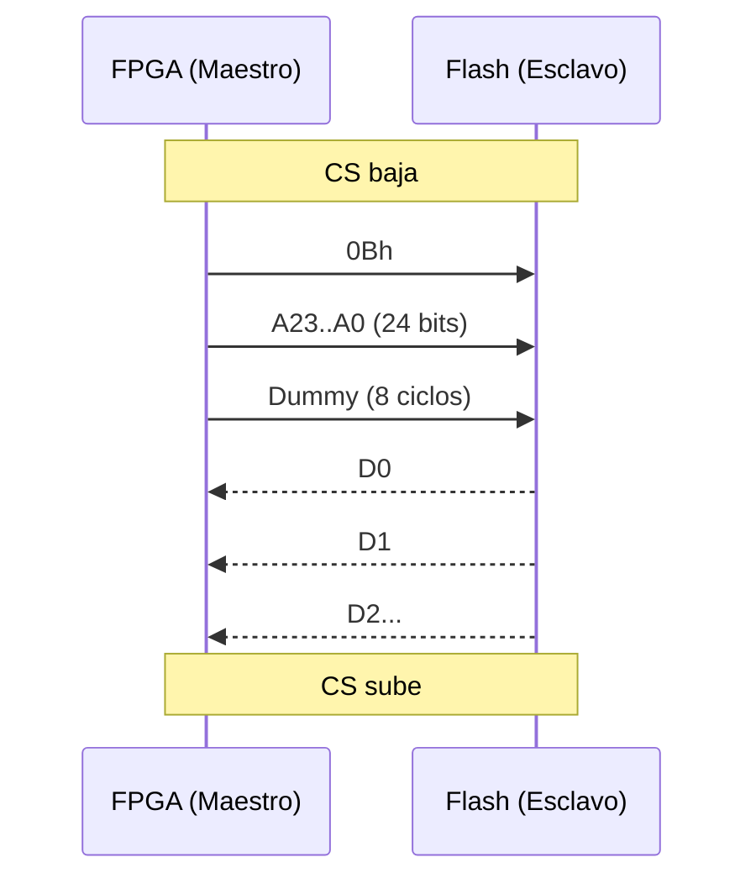
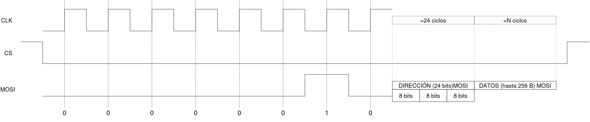
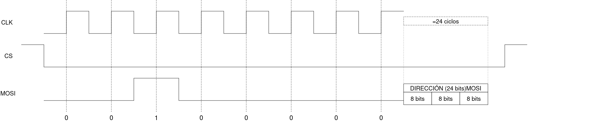
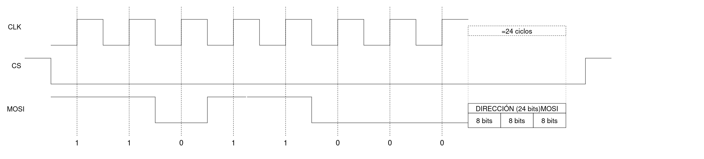
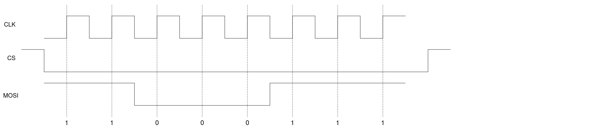
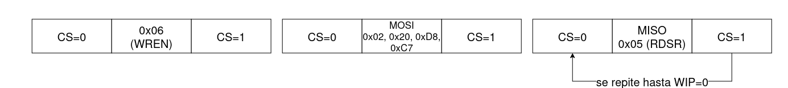

# Protocolo SPI

## 1. Explicación general del protocolo

### 1.1 ¿Qué es SPI?

SPI (**Serial Peripheral Interface**) es un protocolo de comunicación **sincrónico, serie y full-duplex**. Un dispositivo **maestro** (en nuestro caso la FPGA) controla a uno o varios **esclavos** (en este caso, la memoria Flash).

### 1.2 Señales del bus

El protocolo cuenta con cuatro señales principales de conexión:

| Señal       | Nombre completo            | Función                               |
| ----------- | -------------------------- | ------------------------------------- |
| `SCLK`      | Serial Clock               | Reloj generado por el maestro         |
| `MOSI`      | Master Out Slave In        | Datos del maestro hacia el esclavo    |
| `MISO`      | Master In Slave Out        | Datos del esclavo hacia el maestro    |
| `CS` / `SS` | Chip Select / Slave Select | Activo en bajo. Selecciona el esclavo |

### 1.3 Características principales

* **Protocolo sincrónico:** los datos se leen en los flancos del reloj. La configuración del flanco de lectura y el estado base del reloj determinan los cuatro modos de operación del protocolo.
* **Comunicación full-duplex:** el protocolo soporta comunicación bidireccional simultánea mediante las líneas independientes `MOSI` y `MISO`.
* **Generación del reloj:** la señal de reloj es generada por el maestro.
* **Estabilidad de los datos:** cuando ocurre el flanco utilizado para leer un dato, la información debe encontrarse estable.
* **Velocidad de transmisión:** la frecuencia utilizada debe respetar los tiempos de operación establecidos para la memoria Flash.

### 1.4 Modos SPI (CPOL / CPHA)

La comunicación SPI puede utilizar cuatro configuraciones determinadas por **CPOL** y **CPHA**:

| Modo | CPOL | CPHA | Flanco de muestreo |
| ---- | ---- | ---- | ------------------ |
| 0    | 0    | 0    | Subida             |
| 1    | 0    | 1    | Bajada             |
| 2    | 1    | 0    | Bajada             |
| 3    | 1    | 1    | Subida             |

En memorias Flash se utiliza normalmente **Modo 0** o **Modo 3**, dependiendo de la memoria específica.

El dato cambia en un flanco del reloj y se lee en el otro. Por lo tanto, en el momento del flanco de lectura, el dato debe permanecer estable.

### 1.5 Estructura general de la comunicación

Toda transacción con la Flash sigue, de manera general, el siguiente patrón:

```text
CS baja → [Comando] → [Dirección] → [Dummy, si aplica] → [Datos] → CS sube
```

Los elementos principales de la transacción son:

* **Comando:** 1 byte que indica la operación que se desea realizar.
* **Dirección:** 3 bytes (24 bits) que indican la posición de memoria.
* **Dummy:** 0 o más bytes de relleno utilizados por algunos comandos.
* **Datos:** información que se transmite o recibe.

La secuencia general de la comunicación es:

1. `CS` baja al inicio de la transacción.
2. El maestro genera el reloj.
3. Se transmite el comando.
4. Se transmite la dirección cuando la operación la requiere.
5. Se transmiten ciclos dummy cuando el comando los requiere.
6. Se transmiten o reciben los datos.
7. `CS` sube al finalizar la transacción.


### 1.6 Estructura interna de la memoria 

Como informacion extra, es necesario comprender como se divide la estructura interna de la memoria flash, ya que esto es importante para entender la funcionalidad de las direcciones que se envia en multiples comandos.





Típicamente, estas memorias se dividen en 3 niveles, tal como se muestra en la imagen anterior. La memoria completa tiene una capacidad de 16 MiB, la cual se divide en 256 bloques, cada uno de 64 KB. Cada bloque se divide en 16 sectores, cada uno de 4 KB. Cada sector se vuelve a dividir en 16 paginas, cada una de 256 Bytes y estas ultimas se dividen en los ya mencionados 256 Bytes. Una imagen mas representativa se muestra a continuación.




Las direcciones de memoria que se envian desde el maestro hacia el esclavo se dividen en 4 partes (esto se refiere únicamente a la distribución de la información, las direcciones se envian de forma continua bit tras bit).




---

# 2. Comandos de estado y control

Esta sección presenta los comandos utilizados para controlar la memoria y consultar su estado. Para cada comando se documentará posteriormente su forma de uso y su correspondiente forma de onda.

### 2.1 Índice de comandos

| Código | Comando                | Función                                      |
| ------ | ---------------------- | -------------------------------------------- |
| `06h`  | Write Enable           | Habilita escritura/programación              |
| `04h`  | Write Disable          | Deshabilita escritura/programación           |
| `05h`  | Read Status Register 1 | Consulta el registro de estado               |
| `35h`  | Read Status Register 2 | Consulta información adicional de estado     |
| `01h`  | Write Status Register  | Escribe información en el registro de estado |

### 2.2 Documentación

Para cada comando se incluirá:

* Secuencia de utilización.
* Información transmitida y recibida.
* Forma de onda correspondiente.

---

# 3. Comandos de lectura

Esta sección presenta los comandos utilizados para obtener información almacenada en la memoria Flash. Se documentará posteriormente la estructura de cada comando y su respectiva forma de onda.

### 3.1 Índice de comandos

| Código | Comando               | Descripción                     |
| ------ | --------------------- | ------------------------------- |
| `03h`  | READ                  | Lectura de datos                |
| `0Bh`  | FAST READ             | Lectura rápida con ciclos dummy |

<!--| `3Bh`  | FAST READ DUAL OUTPUT | Lectura mediante dos líneas     |
| `BBh`  | FAST READ DUAL I/O    | Lectura Dual I/O                |
| `6Bh`  | FAST READ QUAD OUTPUT | Lectura mediante cuatro líneas  |
| `EBh`  | FAST READ QUAD I/O    | Lectura Quad I/O                |-->

### 3.2 Documentación

Para cada comando se incluirá:

* Secuencia de utilización.
* Comando, dirección y ciclos dummy cuando correspondan.
* Datos obtenidos mediante la lectura.
* Forma de onda correspondiente.

### 3.3 READ (03h) paso a paso

#### 3.3.1 Secuencia

1. **CS baja.**
2. Enviar `03h` por MOSI.
3. Enviar **dirección de 24 bits** (3 bytes, MSB primero).
4. La Flash empieza a devolver datos por MISO.
5. **CS sube** al terminar.

#### 3.3.2 Trama (diagrama Mermaid)



#### 3.3.3 Tabla de la trama

| Fase | MOSI (FPGA → Flash) | MISO (Flash → FPGA) |
|------|---------------------|---------------------|
| Comando | `03h` | X (no importa) |
| Dirección | A23..A0 (24 bits) | X (no importa) |
| Datos | (no se usa) | D0, D1, D2, D3… |

#### 3.3.4 ¿Cuánta información devuelve?

**Ilimitada.** Mientras CS esté bajo, la Flash sigue sacando bytes y la dirección interna avanza sola. Al llegar al final, vuelve al inicio (**wrap around**).

<!--> Cita de clase: *"hay que tener cuidado porque ese se sobrecribe… termina a los 64 espacios y vuelve a escribir el primer

### 3.4 FAST READ (0Bh) paso a paso

#### 3.4.1 Secuencia

1. **CS baja.**
2. Enviar `0Bh` por MOSI.
3. Enviar **dirección de 24 bits**.
4. Enviar **1 byte dummy** (8 ciclos de reloj, MISO ignorado).
5. La Flash devuelve datos por MISO.
6. **CS sube.**

#### 3.4.2 Trama (diagrama Mermaid)



#### 3.4.3 Tabla de la trama

| Fase | MOSI (FPGA → Flash) | MISO (Flash → FPGA) |
|------|---------------------|---------------------|
| Comando | `0Bh` | X (no importa) |
| Dirección | A23..A0 (24 bits) | X (no importa) |
| Dummy | (nada) | X (8 ciclos vacíos) |
| Datos | (no se usa) | D0, D1, D2, D3… |

### 3.5 Formas de onda


### 3.6 Preguntas resueltas

#### 3.6.1 ¿Por qué FAST READ es más rápido si **añade** un byte dummy?

Porque el byte dummy **no es trabajo extra**, es **tiempo de preparación** para la Flash. La memoria necesita:

- Decodificar la dirección.
- Acceder a la celda de memoria.
- Cargar el dato en el registro de salida.

Ese proceso toma tiempo fijo (nanosegundos). El dummy le da ese tiempo al chip.

**La ganancia real viene de la frecuencia de reloj.**

Cálculo para leer **N = 1000 bytes**:

READ normal a 50 MHz:

$$
T_{read} = \frac{8 + 24 + 8000}{50\times 10^6} = \frac{8032}{50\times 10^6} = 160.6\ \mu s
$$

FAST READ a 104 MHz:

$$
T_{fast} = \frac{8 + 24 + 8 + 8000}{104\times 10^6} = \frac{8040}{104\times 10^6} = 77.3\ \mu s
$$

**FAST READ es ~2 veces más rápido** aunque tenga 8 ciclos extra. El dummy cuesta muy poco y a cambio se duplica la frecuencia.

> **Regla mental:** el byte dummy es la **cuota de entrada** para poder correr el reloj al doble.

#### 3.6.2 ¿Solo se pueden leer 8 bits por comando?

**No.** Cada byte son 8 bits, pero al mantener CS bajo la Flash sigue entregando bytes y **avanza sola la dirección** (modo burst / continuous read).

#### 3.6.3 ¿Toca enviar la trama de nuevo para leer más bits?

**No.** Solo se manda **una vez** comando + dirección. Después se sigue dando reloj y los datos salen consecutivos.

Ejemplo: leer un `uint32_t` desde `0x000100`:

```
CS baja
→ 03h
→ 00h 01h 00h   (dirección)
→ recibes byte0, byte1, byte2, byte3
→ unes: dato = (byte0<<24)|(byte1<<16)|(byte2<<8)|byte3
CS sube
```

#### 3.6.4 ¿Qué comandos van antes o después?

- **Para leer:** no se necesita comando previo.
<!-- **Para escribir o borrar:** primero `06h` (Write Enable).
- **Después de escribir:** revisar con `05h` (Read Status Register) si el chip terminó.-->

<!--### 8.5 ¿Qué diferencia hay con I2S?

En **I2S** la frecuencia de muestreo sí importa (44.2 kHz, 48 kHz). Si se manda el audio más rápido o más lento, se escucha mal. En **SPI** la velocidad no afecta el dato, solo el tiempo que tarda.

> Cita de clase: *"Es la gran diferencia de protocolos SPI frente a todos los demás: el tiempo acá sí importa [en I2S], en los demás no."*-->


---

# 4. Comandos de escritura y borrado

Esta sección presenta los comandos utilizados para modificar el contenido de la memoria Flash, incluyendo las operaciones de programación y borrado.

### 4.1 Índice de comandos

| Código      | Comando      | Función                  |
| ----------- | ------------ | ------------------------ |
| `0x02`       | Page Program | Programa hasta 256 bytes |
| `0x20`       | Sector Erase | Borra un sector de 4 KB  |
| `0xD8`       | Block Erase  | Borra un bloque de 64 KB |
| `0xC7` | Chip Erase   | Borra toda la memoria    |

La estructura de estas 4 funcionalidades poseen la misma estructura base, se genera la señal de reloj desde el maestro, se cambia el `CS` a `0` para indicarle a la memoria que debe escuchar la información que le llegue, la cual tiene la estructura Opencode->direccion->información (únicamente en el comando `0x02`), y la memoria ejecuta la accion indicada. El uso completo de estos comando se explica mas adelante.

#### 4.2.1 Page Program

El comando `0x02` permite escribir en la memoria hasta un total de 256 Bytes, estos se empezaran a escribir a parir de la direccion dada por el maestro, si los datos enviados hacia el esclavo, llegan al final de una pagina, los siguientes es escribiran al inicio de la misma, y no pasaran a la siguiente pagina.




#### 4.2.2 Sector Erase

El comando `0x20` permite borrar un sector completo de la memoria, correspondiente a un tamaño de 4 KB. El borrado se realiza a partir de la dirección indicada por el maestro, tomando como referencia el sector al que pertenece dicha dirección.



#### 4.2.3 Block Erase

El comando `0xD8` permite borrar un bloque completo de la memoria, correspondiente a un tamaño de 64 KB. El borrado se realiza a partir de la dirección indicada por el maestro, tomando como referencia el bloque al que pertenece dicha dirección.



#### 4.2.4 Chip Erase

El comando `0xC7` permite borrar completamente el contenido de la memoria, eliminando los datos almacenados en todos sus sectores y bloques. A diferencia de los comandos anteriores, no requiere una dirección específica para determinar la zona que será borrada.




### 4.3 Uso práctico de los comandos de escritura y borrado

El uso práctico de estos cuatro comandos comparte una estructura general. Antes de ejecutar cualquier operación de escritura o borrado, se debe enviar el comando `0x06` (Write Enable), el cual habilita la memoria para realizar este tipo de operaciones.

Posteriormente, se envía el comando correspondiente a la operación que se desea realizar: `0x02` (Page Program), `0x20` (Sector Erase), `0xD8` (Block Erase) o `0xC7` (Chip Erase).

Una vez iniciada la operación, la memoria necesita un tiempo para completarla. Durante este proceso, se utiliza el comando `0x05` (Read Status Register) para consultar el estado de la memoria. Este comando puede repetirse hasta verificar que la operación haya finalizado. La información del registro de estado es enviada por la memoria hacia el maestro mediante la línea `MISO`. Este proceso se ilustra a continuación.




---

# 5. Diagrama de flujo general del protocolo

Esta sección presenta el **diagrama de flujo general del protocolo SPI para la memoria Flash**, mostrando de manera global la secuencia que sigue una transacción desde la activación de `CS` hasta su finalización.

El diagrama de flujo utilizado para representar esta secuencia se encuentra en los archivos gráficos incluidos en este directorio.


---


